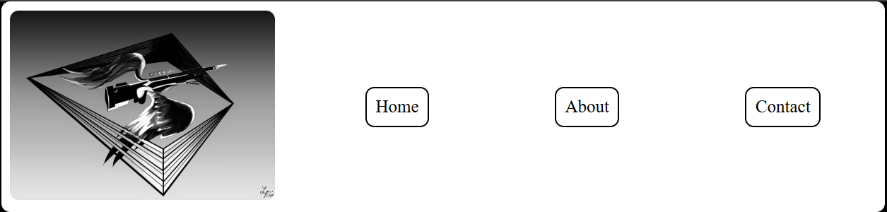
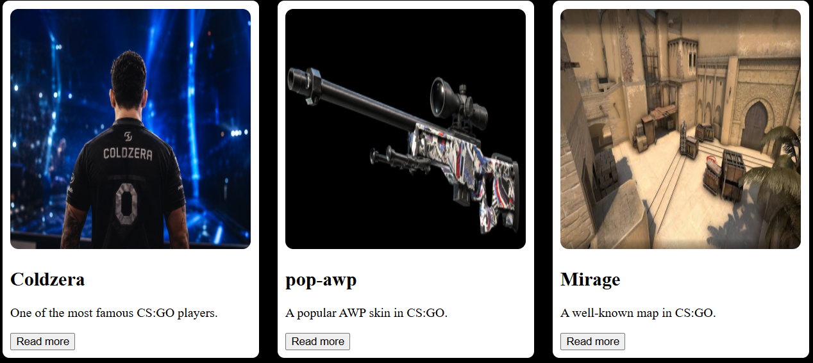
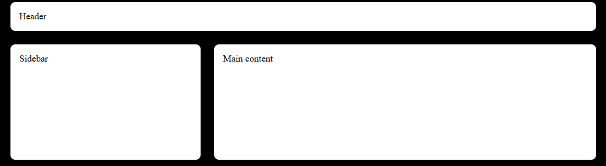
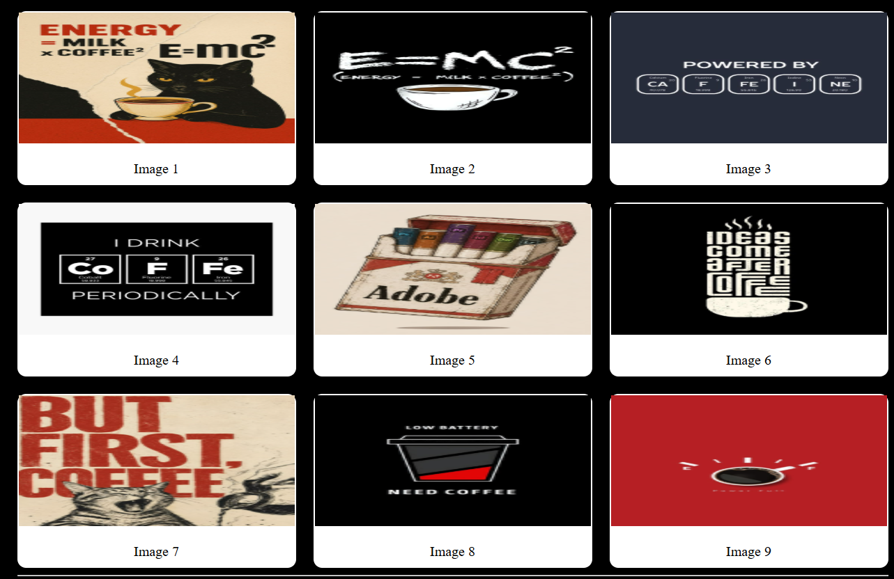
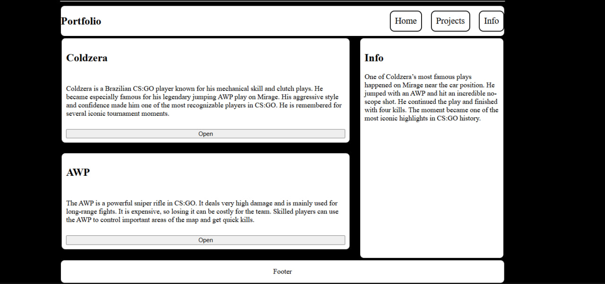

## Name and Group
Nurgissa Pernebay, SE2539

## Task 0 Navigation Bar
Navigation bar with a logo and links. I used Flexbox to place the logo and links in one row.

## Task 1 Card Row
I created three cards. Each card has an image, title, text and button. i used Flexbox to place the cards in one row.

## Task 2 Page Layout with Grid
Layout with a header, sidebar, main content and footer. I used CSS Grid to place the sections.

## Task 3 Image Gallery
I created an image gallery with nine images. I used CSS Grid to place the images in three columns and three rows.

## Task 4 Portfolio Page
Portfolio page with projects, an info section and a footer. I used Flexbox and CSS Grid for the layout.

## Summary
I learned how to use Flexbox for navigation and cards. I used CSS Grid for layouts and the image gallery.
